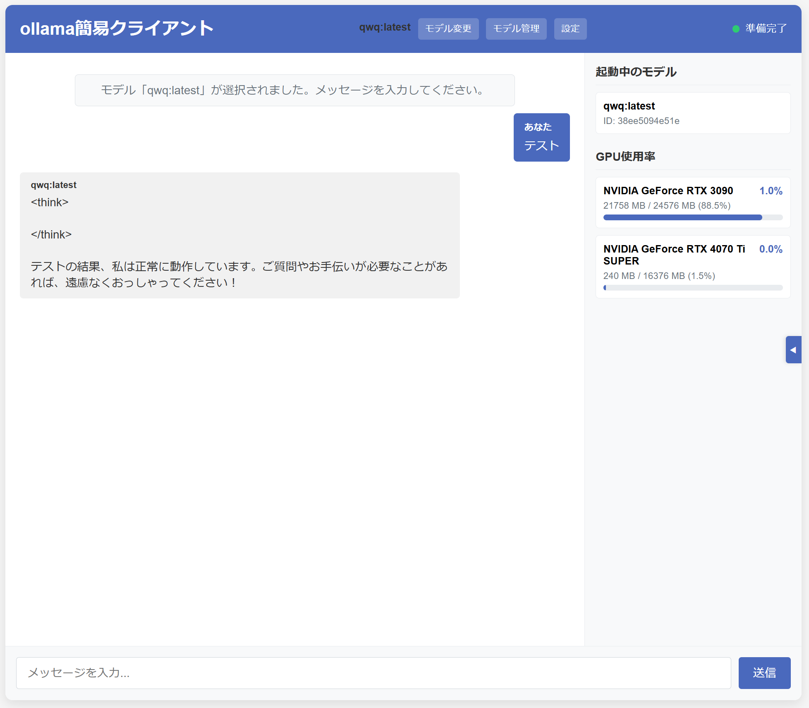

# ollama簡易クライアント

ollamaサーバーを使用したWebアプリケーションです。ブラウザ上で大規模言語モデル（LLM）とチャットができます。



## 機能

### チャット機能
- ollamaサーバーからモデル一覧を取得・表示
- モデルの選択とチャット開始
- ユーザーメッセージの送信とollamaの言語モデルからの応答表示
- ストリーミングレスポンスのリアルタイム表示
- コードブロックの自動フォーマットとコピー機能

### モデル管理機能
- 起動中のモデル一覧表示
- モデル終了機能
- GPU使用率のリアルタイム表示

### 設定機能
- モデルパラメータの設定（温度、top_p、top_k、コンテキスト長、繰り返しペナルティ）
- 設定の保存と適用

### UI機能
- レスポンシブデザイン
- サイドバーの折りたたみ機能
- ダークモード対応（ブラウザの設定に準拠）

## 必要条件

- Python 3.8以上
- ollamaサーバーが実行されていること（デフォルトでは`http://localhost:11434`）

## インストール

```bash
# リポジトリのクローン
git clone https://github.com/t-nakabayashi/llm_client.git
cd llm_client

# 依存パッケージのインストール
pip install -r requirements.txt
```

## 使い方

アプリケーションの起動:

```bash
python -m src.main
```

起動後、ブラウザで http://127.0.0.1:5000 にアクセスすると、チャットインターフェースが表示されます。

### 環境変数

以下の環境変数を設定することで、アプリケーションの動作をカスタマイズできます:

- `OLLAMA_HOST`: ollamaサーバーのホスト（デフォルト: `http://localhost:11434`）
- `HOST`: Webサーバーのホスト（デフォルト: `127.0.0.1`）
- `PORT`: Webサーバーのポート（デフォルト: `5000`）
- `DEBUG`: デバッグモードの有効/無効（デフォルト: `False`）

例:
```bash
# ollamaサーバーが別のマシンで動作している場合
export OLLAMA_HOST=http://192.168.1.100:11434

# 外部からアクセス可能にする場合
export HOST=0.0.0.0

# ポートを変更する場合
export PORT=8080

# デバッグモードを有効にする場合
export DEBUG=true
```

### Dockerを使用する場合

開発環境をDockerで構築することもできます。

1. 開発環境の起動:

```bash
docker compose up -d
```

2. コンテナ内でコマンドを実行:

```bash
# コンテナのシェルにアクセス
docker compose exec app /bin/bash
```

3. 開発環境の停止:

```bash
docker compose down
```

## テスト

テストの実行:

```bash
pytest
```

### Dockerでのテスト実行

コンテナ内でテストを実行:

```bash
docker compose exec app pytest
```

## プロジェクト構成

- `src/`: ソースコード
  - `app.py`: Webアプリケーションのメインモジュール
  - `main.py`: アプリケーションのエントリーポイント
  - `chat_session.py`: チャットセッションを管理するモジュール
  - `ollama_client.py`: ollamaサーバーとの通信を担当するモジュール
  - `static/`: 静的ファイル
    - `css/style.css`: スタイルシート
    - `js/chat.js`: フロントエンドのJavaScriptコード
  - `templates/`: HTMLテンプレート
    - `index.html`: メインページのテンプレート
- `tests/`: テストコード
  - `test_app.py`: アプリケーションのテスト
  - `test_chat_session.py`: チャットセッションのテスト
  - `test_main.py`: エントリーポイントのテスト
  - `test_ollama_client.py`: ollamaクライアントのテスト
- `docs/`: ドキュメント
  - `design.md`: 設計書
